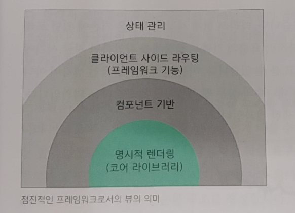

# Vuejs 01~03장

## Vue.js 소개
- Vue.js란?
  - 화면단 라이브러리: 화면단 데이터 표현에 관한 기능들 중점적으로 지원(뷰 코어 라이브러리)
  - 프레임워크: 라우터, 상태 관리, 테스팅 등을 쉽게 결합할 수 있는 형태로 제공(프레임워크)
  - 점진적인 프레임워크(progressive framework)
    
    
- Vue.js의 특징
  - UI 화면단 라이브러리
  ```
  MVVM(Model - View - ViewModel): 마크업 언어나 GUI 코드를 비즈니스 로직 또는 백엔드 로직과 분리하여 개발하는 소프트웨어 디자인 패턴 
  ```
    - 처리 흐름: 버튼 클릭 -> 돔 리스너 -> 로직 -> 데이터 바인딩 -> 모델 
- 컴포넌트 기반 프레임워크
  - 코드 재사용성
  - 화면 구조 직관적 파악
  - 협업이 수월
- 리액트와 앵귤러의 장점을 가진 프레임워크
  - 앵귤러의 양방향 데이터 바인딩: 화면에 표시되는 값과 프레임 워크이 모델 데이터 값이 동기화 
  - 리액트의 단방향 데이터 바인딩: 컴포넌트 간 데이터 전달 시 항상 상위 컴포넌트에서 하위 컴포넌트로 전달
  - 리액트의 가상 돔 렌더링 방식 적용: 특정 돔 요소 추가 or 삭제 시 화면 전체를 다시 그리지 않고 프레임워크에서 정의한 방식에 따라 화면을 갱신.
## 개발 환경 설정 및 첫번쨰 프로젝트
- 이 부분은 환경 설정이라 넘어가겠습니다.
## 화면을 개발하기 위한 필수 단위
- 뷰 인스턴스
  ```
  ...
  <body>
    <div id="app">
      {{message}}
    </div>
    <script src="https://cdn.jsdelivr.net/npm/vue@2.5.2/dist/vue.js"></script>
    <script>
      new Vue({ // Vue는 생성자
        el: '#app',
        data: {
          message: 'Hello Vue.js'
        }
      });
    </script>
  </body>
  ...
  ```
  - 인스턴스 옵션 속성: 
    el(돔 요소, css 선택자) 
    data(데이터) 
    template(화면에 표시할 마크업 요소를 정의하는 속성) 
    methods(화면 로직 제어와 관계된 메서드 정의) 
    created(인스턴스 생성 시 실행할 로직 정의)
  - 뷰 인스턴스의 유효 범위
  
- 뷰 컴포넌트
- 뷰 컴포넌트 통신
