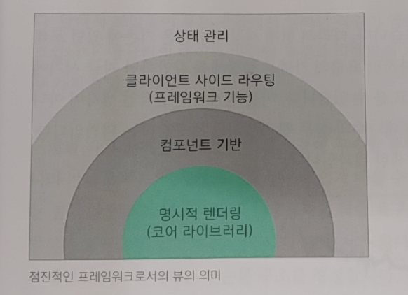
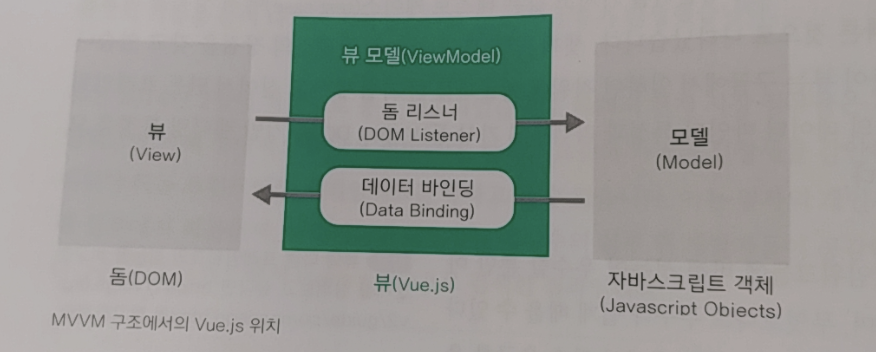
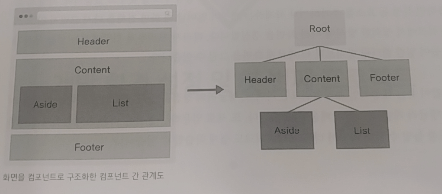
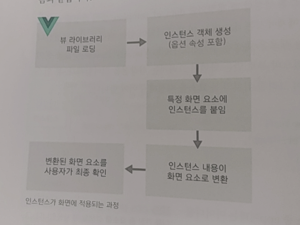
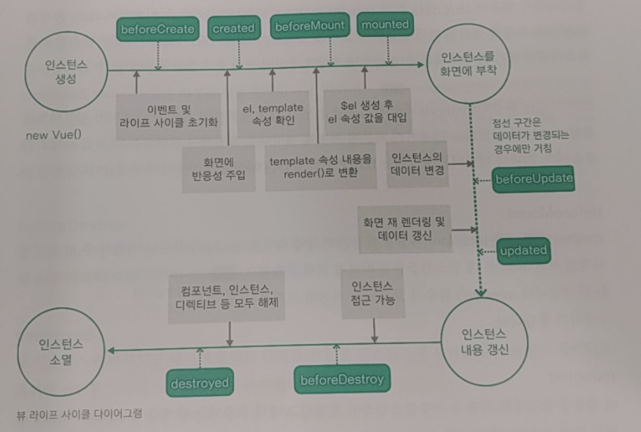
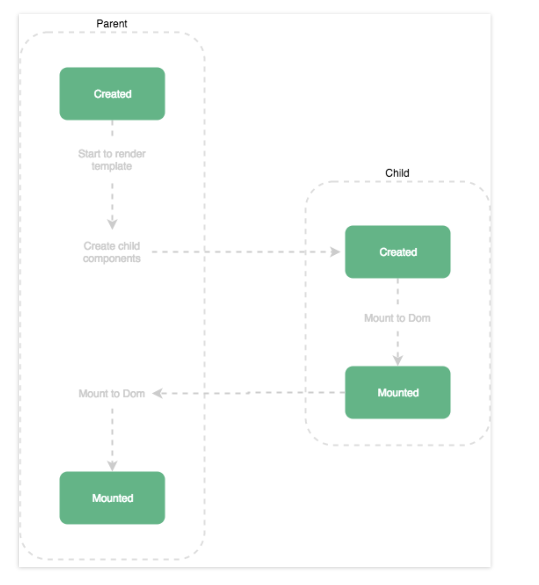
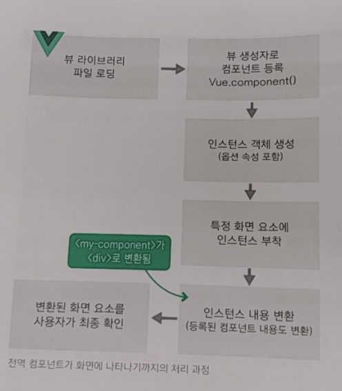
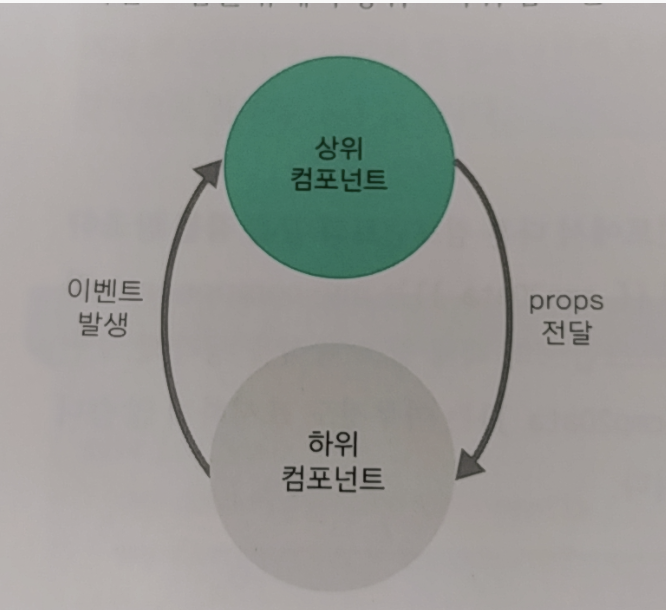
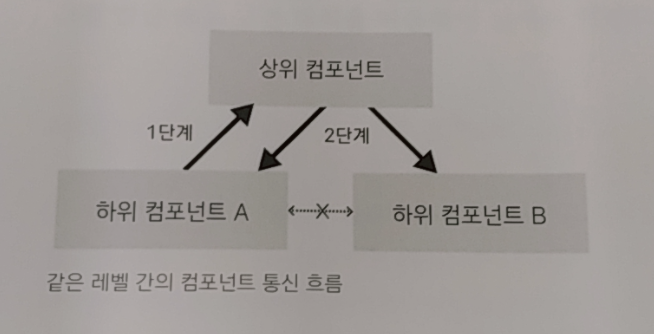

# Vuejs 01~03장

## Vue.js 소개
- Vue.js란?
  - 화면단 라이브러리: 화면단 데이터 표현에 관한 기능들 중점적으로 지원(뷰 코어 라이브러리)
  - 프레임워크: 라우터, 상태 관리, 테스팅 등을 쉽게 결합할 수 있는 형태로 제공(프레임워크)
  - 점진적인 프레임워크(progressive framework)
  

- Vue.js의 특징
  - UI 화면단 라이브러리
  
    
    ```
    MVVM(Model - View - ViewModel): 마크업 언어나 GUI 코드를 비즈니스 로직 또는 백엔드 로직과 분리하여 개발하는 소프트웨어 디자인 패턴 
    ```
    - 처리 흐름: 버튼 클릭 -> 돔 리스너 -> 로직 -> 데이터 바인딩 -> 모델 
- 컴포넌트 기반 프레임워크


  - 코드 재사용성
  - 화면 구조 직관적 파악
  - 협업이 수월
- 리액트와 앵귤러의 장점을 가진 프레임워크
  - 앵귤러의 양방향 데이터 바인딩: 화면에 표시되는 값과 프레임 워크이 모델 데이터 값이 동기화 
  - 리액트의 단방향 데이터 바인딩: 컴포넌트 간 데이터 전달 시 항상 상위 컴포넌트에서 하위 컴포넌트로 전달
  - 리액트의 가상 돔 렌더링 방식 적용: 특정 돔 요소 추가 or 삭제 시 화면 전체를 다시 그리지 않고 프레임워크에서 정의한 방식에 따라 화면을 갱신.
## 개발 환경 설정 및 첫번쨰 프로젝트
- 이 부분은 환경 설정이라 넘어가겠습니다.
## 화면을 개발하기 위한 필수 단위
- 뷰 인스턴스
  ```
  ...
  <body>
    <div id="app">
      {{message}}
    </div>
    <script src="https://cdn.jsdelivr.net/npm/vue@2.5.2/dist/vue.js"></script>
    <script>
      new Vue({ // Vue는 생성자
        el: '#app',
        data: {
          message: 'Hello Vue.js'
        }
      });
    </script>
  </body>
  ...
  ```
  - 인스턴스 옵션 기본 속성: 
    - el(돔 요소, css 선택자) 
    - data(데이터)
    - created(인스턴스 생성 시 실행할 로직 정의)
    - template(화면에 표시할 마크업 요소를 정의하는 속성) 
    - methods(화면 로직 제어와 관계된 메서드 정의) 
  - 뷰 인스턴스의 유효 범위
  


  - 뷰 인스턴스 라이프 사이클
  

  - 라이플 사이클 속성: 인스턴스의 상태에 따라 호출할 수 있는 속성
    - beforeCreate: data, method 미정의, 돔에 접근 불가
    - created: data, method 정의, 돔에 접근 불가
      - data와 method 속성에 접근할 수 있는 가장 첫 단계이자 컴포넌트가 생성된 시점이기에 서버에 데이터를 요청하여 받아오는 로직을 수행하기 좋다.
    - beforeMount: template 속성에 지정한 마크업 속성을 render() 함수로 변환한 후이자 돔에 인스턴스를 부착하지 전 호출.
      - render() 함수가 호출되기 직전의 로직을 추가하기 좋다.
    - mounted: el 속성에서 지정한 화면 요소에 인스턴스가 부착되고 나면 호출되는 단계. template 속성에 정의한 화면 요소에 접근이 가능
      - 화면 요소를 제어하는 로직을 수행하기 좋다.
      - 단, 하위 컴포넌트나 외부 라이브러리에 의해 추가된 화면 요소들이 최종 html 코드로 변환되는 시점과 다를 수 있다. 모든 자식 컴포넌트가 마운트된 상태를 보장하지 않는다. ($nextTick() API를 활용하여 html 코드로 시점을 맞춰줄 수 있다.)        
      
    - beforeUpdate: 관찰하고 있는 데이터가 변경되면 화면을 다시 그리기 전에 호출된다.
      - 변경 예정인 새 데이터에 접근할 수 있어 변경 예정 데이터의 값과 관련된 로직을 수행하기 좋다.
  ```
  뷰의 반응성: 코드의 변화에 따라 화면이 반사적으로 반응하여 빠르게 화면을 갱신하는 것.
  데이터 관찰: 화면 요소에 인스턴스가 부착된 후 인스턴스에 정의한 속성들이 화면에 치환되는데 이 치환된 값을 뷰의 반응성을 제공하기 위해 $watch 속성으로 감시하는 것.
  ```
    - updated: 화면을 다시 그리고 나면 실행.
      - 데이터 변경 후 화면 요소 제어와 관련된 로직을 추가하기 좋은 단계
    - beforeDestroy: 뷰 인스턴스가 파괴되기 직전에 호출.
      - 인스턴스에 아직 접근이 가능하기 때문에 인스턴스의 데이터를 삭제하기 좋다.
    - destroyed: 뷰 인스턴스 파괴 후 호출.
  - 라이프 사이클 훅(hook): 라이프 사이클 속성에서 실행되는 커스텀 로직
    

  ```
    new Vue({
      data: {
        a: 1
      },
      created: function () {
        // `this` 는 vm 인스턴스를 가리킵니다.
        console.log('a is: ' + this.a)
      }
    })
  ```
  ```
    options 속성이나 콜백에 화살표 함수 사용을 지양하기 바랍니다.
    ex) created: () => console.log(this.a) 이나 vm.$watch('a', newValue => this.myMethod())
    화살표 함수들은 부모 컨텍스트에 바인딩되기 때문에, this 컨텍스트가 호출하는 Vue 인스턴스에서 사용할 경우 오류가 발생하게 됩니다.
    ex) Uncaught TypeError: Cannot read property of undefined 또는 Uncaught TypeError: this.myMethod is not a function
  ```
- 뷰 컴포넌트 등록하기
  - 전역 컴포넌트: 뷰 라이브러리를 로딩하고 나면 접근 가능한 Vue 변수를 이용해서 등록
  ```
    Vue.component('컴포넌트 이름', {
      // 컴포넌트 내용
    });
  ```
    

  - 지역 컴포넌트: 인스턴스에 components 속성을 이용해 등록
  ```
  new Vue({
    components: {
      '컴포넌트 이름': 컴포넌트 내용
    }
  });
  ```
  - 차이: 유효 범위
- 뷰 컴포넌트 통신
  - 각 컴포넌트의 유효 범위가 독립적이기 떄문에 다른 컴포넌트의 값을 직접적으로 참조할 수 없다.
  
  - 상하위 컴포넌트 관계
  
    - props 속성
  ```
    <child-component v-bind:props 속성이름="상위 컴포넌트의 data 속성"></child-component>
    ...
    Vue.component('child-component', {
      props: ['props 속성 이름]
    });
  ```
    - 이벤트 발생과 수신
  ```
    // 이벤트 발생
    this.$emit('이벤트명");
    ...
    // 이벤트 수신
    <child-component v-on:이벤트명="상위 컴포넌트의 메서드명"></child-component>
  ```
  - 같은 레벨의 컴포넌트
  
  
  - 이벤트 버스: 관계 없는 컴포넌트 간 통신 가능
  ```
    // 이벤트 버스를 위한 추가 인스턴스 1개 생성
    let eventBus = new Vue();
    ...
    // 이벤트를 보내는 컴포넌트
    methods: {
      메서드명: function() {
        eventBus.$emit('이벤트명', 데이터);
      }
    }
    ...
    //이벤트를 받는 컴포넌트
    methods: {
      created: function() {
        eventBus.$on('이벤트명', function(데이터) {
          ...
        });
      }
    }
  ```
    장점: props 속성 없이도 원하는 컴포넌트 간에 직접적인 데이터 전달이 가능.
    단점: 컴포넌트가 많아지면 어디서 어디로 보냈는지 관리가 되자 않음.
    => 뷰엑스(Vuex)라는 상태 관리 도구로 문제 해결이 가능함.
